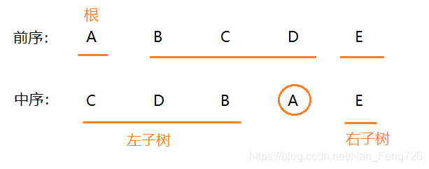
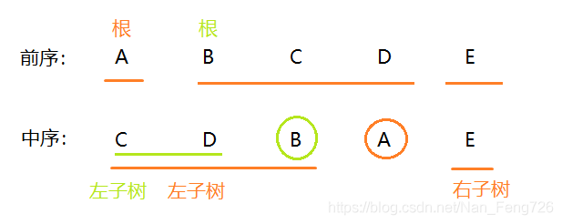
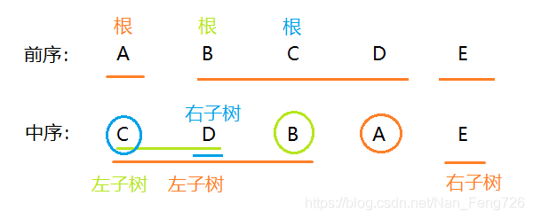
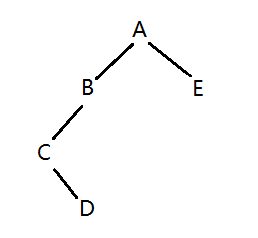

# 004-重建二叉树

## 题目描述

输入某二叉树的前序遍历和中序遍历的结果，请重建出该二叉树。假设输入的前序遍历和中序遍历的结果中都不含重复的数字。例如输入前序遍历序列{1,2,4,7,3,5,6,8}和中序遍历序列{4,7,2,1,5,3,8,6}，则重建二叉树并返回。

示例：

> 输入：
>
> ```
> [1,2,3,4,5,6,7],[3,2,4,1,6,5,7]
> ```
>
> 返回值：
>
> ```
> {1,2,5,3,4,6,7}
> ```

## 数据结构

```java
// Definition for binary tree
public class TreeNode {
    int val;
    TreeNode left;
    TreeNode right;
    TreeNode(int x) { val = x; }
}
```

## 解法一：递归法

时间复杂度：O(n)

空间复杂度：O(n)

1. 根据前序第一个节点可以决定根节点；
2. 根据根结点在中序中的位置，可以分割出左右两个子序列；
3. 对左子树和右子树分别执行步骤1、2

举例：

> 前序：ABCDE
> 中序：CDBAE

1. 首先可以确定A是这棵树的根节点，然后根据中序遍历切出A的左右子树，得到BCD属于A的左子树，E属于A的右子树，如下图：

   

2. 接着以B为根节点，在中序遍历中再次切出B的左右子树，得到CD为B的左子树，右子树为空。

   

3. 再以C为根节点，结合中序遍历，得到D为C的右子树，左子树为空。

   

创建好的二叉树如下图所示：



```java
import java.util.Arrays;
public class Solution {
    public TreeNode reConstructBinaryTree(int [] pre,int [] in) {
        if(pre.length == 0 || in.length == 0){
            return null;
        }
        TreeNode root = new TreeNode(pre[0]);
        for(int i=0; i < pre.length; i++){
            if(in[i] == pre[0]){
                root.left = reConstructBinaryTree(Arrays.copyOfRange(pre, 1, i+1), Arrays.copyOfRange(in, 0, i));
                root.right = reConstructBinaryTree(Arrays.copyOfRange(pre, i+1, pre.length), Arrays.copyOfRange(in, i+1, in.length));
                break;
            }
        }
        return root;
    }
}
```

参考：[根据前序遍历与中序遍历构造二叉树](https://blog.csdn.net/Nan_Feng726/article/details/91049122)、[【剑指offer】重建二叉树 --Java实现](https://blog.nowcoder.net/n/2cbe9f458bd74be1a910aa6d071aa411?f=comment) 