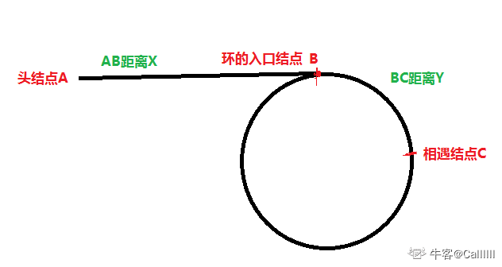
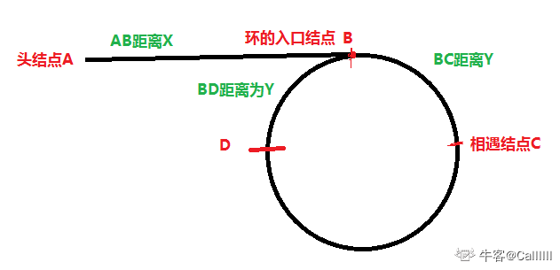

# 055-链表中环的入口结点

## 题目描述

给一个链表，若其中包含环，请找出该链表的环的入口结点，否则，输出null。

## 数据结构

```java
public class ListNode {
    int val;
    ListNode next = null;

    ListNode(int val) {
        this.val = val;
    }
}
```

## 解法一：哈希法（无脑保存）

时间复杂度：O(n)

空间复杂度：O(n)

把链表的每个节点存进HashSet，如果有重复，则为环的入口结点。

1. 遍历单链表的每个结点
2. 如果当前结点地址没有出现在set中，则存入set中
3. 否则，出现在set中，则当前结点就是环的入口结点
4. 整个单链表遍历完，若没出现在set中，则不存在环

```java
import java.util.HashSet;
public class Solution {

    public ListNode EntryNodeOfLoop(ListNode pHead)
    {
        HashSet<ListNode> set = new HashSet<>();
        while(pHead != null){
            if(set.contains(pHead)){
                return pHead;
            }else{
                set.add(pHead);
            }
            pHead = pHead.next;
        }
        return null;
    }
}
```

## 解法二：双指针法

时间复杂度：O(n)
空间复杂度：O(1)

[官方题解](https://blog.nowcoder.net/n/9d3ffa4b004e43d1aff512141d0d7dac?f=comment)：由于两链表长度不一致，所以无法同时遍历到第一个公共结点。所以考虑在两链表后拼接上另一链表达到长度相同的效果。



1. 初始化：快指针fast指向头结点， 慢指针slow指向头结点

2. 让fast一次走两步， slow一次走一步，第一次相遇在C处，停止

3. 然后让fast指向头结点，slow原地不动，让后fast，slow每次走一步，当再次相遇，就是入口结点。
   如上解释：

   

   如果慢指针slow第一次走到了B点处，距离C点处还有距离Y，那么fast指针应该停留在D点处，且BD距离为Y（图中所示是假设快指针走了一圈就相遇，为了便于分析），也就是DB+BC=2Y，（因为fast一次走2步，慢指针一次走1步，并且相遇在C处）在C点处，此时慢指针slow走的点为ABC，距离为X+Y，而快指针fast走的点为ABCDBC，距离为2X+2Y，又因为：AB=X，BC=Y，快指针走了2次BC，所以CDB距离为X，而AB距离也为X。

```java
import java.util.HashSet;
public class Solution {

    public ListNode EntryNodeOfLoop(ListNode pHead)
    {
        ListNode fast = pHead;
        ListNode slow = pHead;
        while(fast != null && fast.next != null){
            fast = fast.next.next;
            slow = slow.next;
            if(fast == slow){
                break;
            }
        }
        if(fast == null || fast.next == null){
            return null;
        }
        fast = pHead;
        while(fast != slow){
            fast = fast.next;
            slow = slow.next;
        }
        return fast;
    }
}
```

