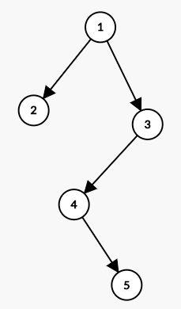
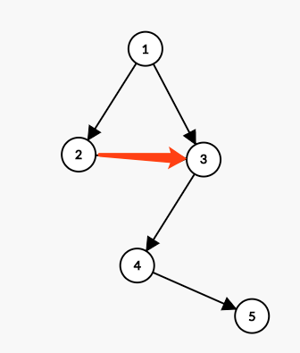

# tree数据结构及模板

## 1. 数据结构

**TreeNode**

```java
public class TreeNode {
    int val = 0;
    TreeNode left = null;
    TreeNode right = null;

    public TreeNode(int val) {
        this.val = val;

    }
```

TreeNode是经典的二叉树节点，在数据的序列化和反序列按照层遍历来处理的。



以上二叉树会被序列化为 {1,2,3,#,#,4,#,#,5}
1：root节点1，是第一层
2, 3：然后第二层是2，3
#, #, 4, #：第三层分别是2节点的两个孩子节点空，用#来表示，然后3节点的左孩子为4，右孩子节点为#
#,5：第四层4节点的左孩子是空，右孩子为5
最后一层5节点的两个空孩子不遍历


**TreeLinkNode**

```java
public class TreeLinkNode {
    int val;
    TreeLinkNode left = null;
    TreeLinkNode right = null;
    TreeLinkNode next = null;
    public TreeLinkNode(int x){
        this.val = val;
    }
};
```

在TreeNode的基础上，额外横向增加一个链接节点，数据的序列化格式在TreeNode的基础上，额外增加next节点的数据，图中红色链路为next



上图中2节点的next为3节点，以上链接二叉树会被序列化为 {[1,2,3,#,#,4,#,#,5],[#,3,#,#,#]}

注意这个数据结构中，所有的节点val必须不同，否则OJ在解析数据的时候后半段的link数据就无法定位准确的节点


## 2. 遍历模板

前序、中序、后序、层次遍历

**前序遍历：** 

```java
//前序遍历递归的方式
public void preOrder(TreeNode root){
    if(root != null){
        System.out.print(root.val+"\t");
        preOrder(root.left);
        preOrder(root.right);
    }
}

//前序遍历非递归的方式
public void preOrderNonRecursive(TreeNode root){
    Stack<TreeNode> stack = new Stack<TreeNode>();
    while(true){
        while(root != null){
            System.out.print(root.val + "\t");
            stack.push(root);
            root=root.left;
        }
        if(stack.isEmpty()) 
            break;
        root=stack.pop();
        root=root.right;
    }
}
```


**中序遍历：** 

```java
//中序遍历递归的方式
public void inOrder(TreeNode root){
    if(root != null){
        inOrder(root.left);
        System.out.print(root.val+"\t");
        inOrder(root.right);
    }
}

//中序遍历非递归的方式
public void inOrderNonRecursive(TreeNode root){
    Stack<TreeNode> stack = new Stack<TreeNode>();
    while(true){
        while(root != null){
            stack.push(root);
            root=root.left;
        }
        if(stack.isEmpty()) 
            break;
        root=stack.pop();
        System.out.print(root.val+"\t");
        root=root.right;
    }
}
```


**后序遍历：**

```java
//后序遍历递归的方式
public void postOrder(TreeNode root){
    if(root != null){
        postOrder(root.left);
        postOrder(root.right);
        System.out.print(root.val+"\t");
    }
}

//后序遍历非递归的方式
public void postOrderNonRecursive(TreeNode root){
    Stack<TreeNode> stack=new Stack<TreeNode>();
    while(true){
        if(root != null){
            stack.push(root);
            root=root.left;
        }else{
            if(stack.isEmpty()) return;

            if(stack.lastElement().right == null){
                root=stack.pop();
                System.out.print(root.val + "\t");
                while(root == stack.lastElement().right){
                    System.out.print(stack.lastElement().val + "\t");
                    root=stack.pop();
                    if(stack.isEmpty()){
                        break;
                    }
                }
            }

            if(!stack.isEmpty())
                root=stack.lastElement().right;
            else
                root=null;
        }
    }
}
```


**层次遍历：**

```java
public void levelOrder(TreeNode root){
    TreeNode temp;
    Queue<TreeNode> queue=new LinkedList<TreeNode>();
    queue.offer(root);
    while(!queue.isEmpty()){
        temp=queue.poll();
        System.out.print(temp.val + "\t");
        if(temp.left != null)
            queue.offer(temp.left);
        if(temp.right != null){
            queue.offer(temp.right);
        }
    }
}
```


参考：[二叉树遍历-JAVA实现](https://www.cnblogs.com/qiuyong/p/6675492.html) 