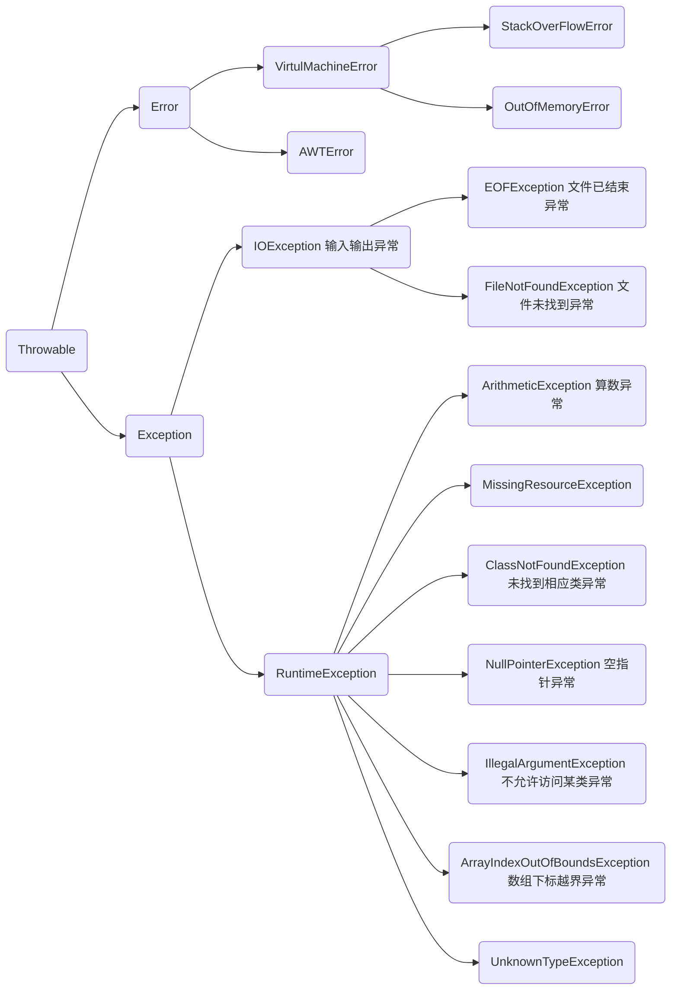

# Java中的异常处理

## java异常类层次结构图

在Java中，所有的异常都有共同的祖先java.lang包下的**Throwable类**。有两大子类：**Exception(异常)**和**Error(错误)**。

**Error(错误)：是程序无法处理的错误**，表示运行的应用程序中较严重的问题。大多数错误与代码编写这执行的操作无关，而表示的是代码运行时JVM出现的问题。这些错误表示故障发生于虚拟机自身、或者发生在虚拟机试图执行应用时。这些错误是不可查的，因为它们在应用程序的控制和处理能力之 外，而且绝大多数是程序运行时不允许出现的状况。对于设计合理的应用程序来说，即使确实发生了错误，本质上也不应该试图去处理它所引起的异常状况。在 Java中，错误通过Error的子类描述。 

**Exception(异常)：是程序本身可以处理的异常。**

## Throwable类常用方法
* public string getMessage(): 返回异常发生时的详细信息
* public string toString(): 返回异常发生时的简要描述
* public string getLocalizedMessage(): 返回异常对象的本地化信息。使用Throwable的子类覆盖这个方法，可
  以声称本地化信息。如果子类没有覆盖该方法，则该方法返回的信息与getMessage()返回的结果相同
* public void printStackTrace(): 在控制台上打印Throwable对象封装的异常信息  

## 异常处理

* try块：用于捕获异常。其后可接任意个catch块，如果没有catch块，则必须跟一个finally块。
* catch块：用于处理try捕获到的异常。
* finally块：无论是捕获还是处理异常，finally块中的语句都会被执行，即使在try或catch块中遇到return，finally语句仍然会在返回之前执行。
  * 若在finally语句中出现了异常，则finally块不会被执行；
  * 若在前面的代码中使用了System.ou()退出程序，则finally块不会被执行；
  * 程序所在线程死亡，则finally块不会被执行；
  * 关闭CPU，则finally块不会被执行。