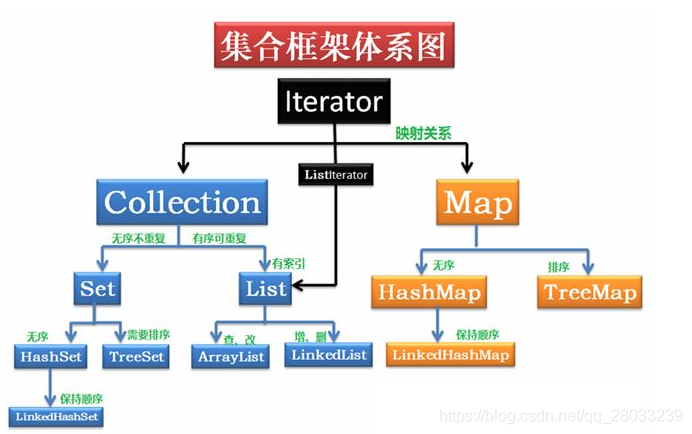

# 集合框架据结构总结

## Collection

### 1. List

* **ArrayList：** Object数组。
* **Vector：** Object数组。
* **LinkedList：** 双向链表（JDK1.6之前为循环链表，JDK1.7取消了循环 ）。

### 2. Set

* **HashSet（无序，唯一）：** 基于HashMap实现，底层采用HashMap来保存数据。
* **LinkedHashSet：** 继承于HashSet，内部通过LinkedHashMap实现。
* **TreeSet（有序，唯一）：** 红黑树（自平衡的排序二叉树）。

## Map

* **HashMap：** JDK1.8之前HashMap由数组+链表组成的，数组是HashMap的主体，链表则是主要为了解决哈希冲突而存在的（“拉链法”解决冲突）.JDK1.8以后在解决哈希冲突时有了较大的变化，当链表长度大于阈值（默认为8）时，将链表转化为红黑树，以减少搜索时间  
* **LinkedHashMap：** 继承于 HashMap，所以它的底层仍然是基于拉链式散列结构即由数组和链表或红黑树组成。另外，LinkedHashMap 在上面结构的基础上，增加了一条双向链表，使得上面的结构可以保持键值对的插入顺序。同时通过对链表进行相应的操作，实现了访问顺序相关逻辑。
* **HashTable：** 数组+链表，数组是HashMap的主体，链表主要是为了解决哈希冲突。
* **TreeMap：** 红黑树（自平衡的排序二叉树）。

参考：[java-集合框架底层数据结构总结](https://blog.csdn.net/qq_28033239/article/details/98204664?utm_medium=distribute.pc_relevant.none-task-blog-BlogCommendFromBaidu-1.not_use_machine_learn_pai&depth_1-utm_source=distribute.pc_relevant.none-task-blog-BlogCommendFromBaidu-1.not_use_machine_learn_pai)