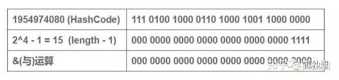
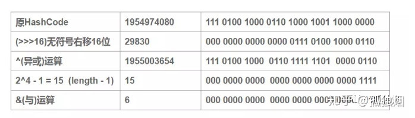

# HashMap的长度为什么是2的幂次方

**为什么扩容是2的次幂?**

HashMap为了存取高效，要尽量较少碰撞，就是要尽量把数据分配均匀，每个链表长度大致相同，这个实现就在把数据存到哪个链表中的算法；

这个算法实际就是取模，hash%length。 但是，大家都知道这种运算不如位移运算快。

因此，源码中做了优化hash&(length-1)。 也就是说hash%length==hash&(length-1)

**那为什么是2的n次方呢？**

因为2的n次方实际就是1后面n个0，2的n次方-1，实际就是n个1。 例如长度为8时候，3&(8-1)=3 2&(8-1)=2 ，不同位置上，不碰撞。 而长度为5的时候，3&(5-1)=0 2&(5-1)=0，都在0上，出现碰撞了。 所以，保证容积是2的n次方，是为了保证在做(length-1)的时候，每一位都能&1 ，也就是和1111……1111111进行与运算。

**为什么要先高16位异或低16位再取模运算？**

jdk1.8里的hash方法：

```java
static final int hash(Object key) {
    int h;
    return (key == null) ? 0 : (h = key.hashCode()) ^ (h >>> 16);
}
```

hashmap这么做，只是为了降低hash冲突的几率。打个比方， 当我们的length为16的时候，哈希码(字符串“abcabcabcabcabc”的key对应的哈希码)对(16-1)与操作，对于多个key生成的hashCode，只要哈希码的后4位为0，不论不论高位怎么变化，最终的结果均为0。 如下图所示



而加上高16位异或低16位的“扰动函数”后，结果如下



可以看到: 扰动函数优化前：1954974080 % 16 = 1954974080 & (16 - 1) = 0 扰动函数优化后：1955003654 % 16 = 1955003654 & (16 - 1) = 6 很显然，减少了碰撞的几率。


参考：[HashMap面试指南](https://zhuanlan.zhihu.com/p/76735726) 