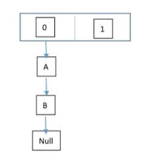
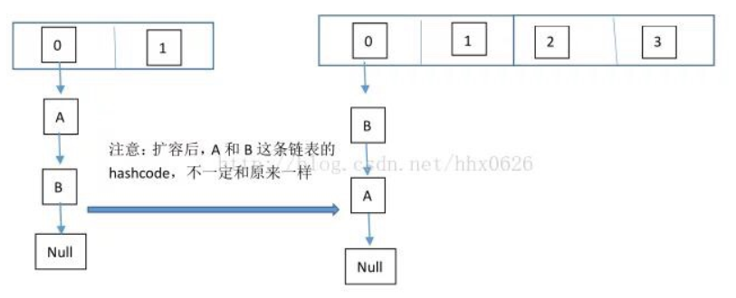
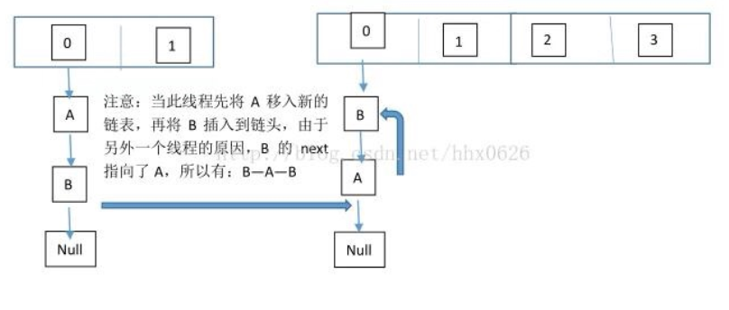

# HashMap 多线程操作导致死循环问题  

在多线程下，进行 put 操作会导致 HashMap 死循环，原因在于 HashMap 的扩容 resize()方法。由于扩容是新建一个数组，复制原数据到数组。由于数组下标挂有链表，所以需要复制链表，但是多线程操作有可能导致环形链表。复制链表过程如下:

以下模拟2个线程同时扩容。假设，当前 HashMap 的空间为2（临界值为1），hashcode 分别为 0 和 1，在散列地址 0 处有元素 A 和 B，这时候要添加元素 C，C 经过 hash 运算，得到散列地址为 1，这时候由于超过了临界值，空间不够，需要调用 resize 方法进行扩容，那么在多线程条件下，会出现条件竞争，模拟过程如下：

线程一：读取到当前的 HashMap 情况，在准备扩容时，线程二介入  

线程二：读取 HashMap，进行扩容  

线程一：继续执行  

这个过程为，先将 A 复制到新的 hash 表中，然后接着复制 B 到链头（A 的前边：B.next=A），本来 B.next=null，到此也就结束了（跟线程二一样的过程），但是，由于线程二扩容的原因，将 B.next=A，所以，这里继续复制A，让A.next=B，由此，环形链表出现：B.next=A; A.next=B

**注意：jdk1.8已经解决了死循环的问题。**  

